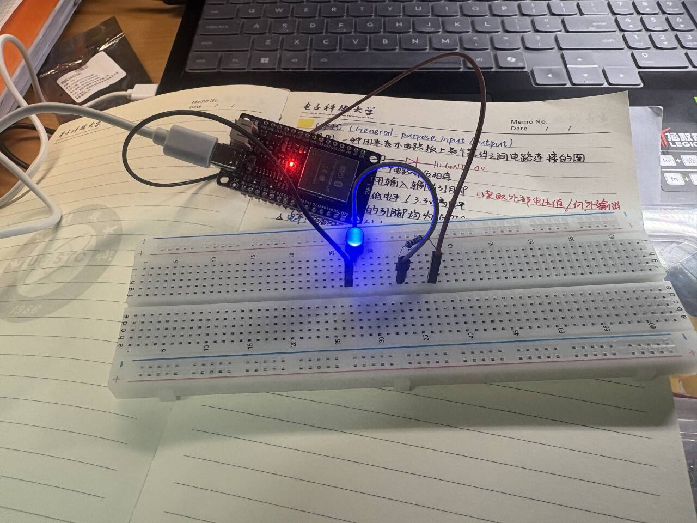
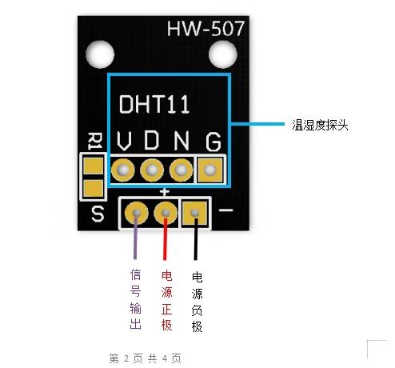

# iot-recruitment-ChenXingyu
My first try in IoT direction of embedded system
### 项目一：点灯&联网
#### 1、点灯
##### 1.1、使用ESP32开发板和ArduinoIDE开发环境，执行点灯命令
```C
void setup() {
  // put your setup code here, to run once:
  //设定引脚为输出模式
  pinMode(led_pin,OUTPUT);
  //点亮LED,给引脚赋一个高电平的值
  digitalWrite(led_pin,HIGH);

}

void loop() {
  // put your main code here, to run repeatedly:

}

```
##### 1.2、效果图


#### 2、联网
##### 2.1、连接并找出手机热点的IP地址
```C
#include <WiFi.h>
void setup() {
  // put your setup code here, to run once:
  Serial.begin(115200);

  Serial.print("正在连接到: ");
  Serial.println("Stars_iPhone");
  Serial.println("【测试】串口通信正常！程序已开始执行！");
  WiFi.begin("Stars_iPhone","ivfusbivm");

  int attempts = 0;

  while(WiFi.status() != WL_CONNECTED && attempts < 30){
    delay(500);
    Serial.print(".");
    attempts++;
  }

  if (WiFi.status() == WL_CONNECTED) {
    Serial.println("\n✅ 连接成功！IP地址: " + WiFi.localIP().toString());
  } else {
    Serial.println("\n❌ 连接失败！请检查热点信息。");
  }

}

void loop() {
  // put your main code here, to run repeatedly:

}

```
##### 2.2、搭建网页服务器，并与点灯操作关联
```C
#include <WiFi.h>       // ESP32专用的WiFi库
#include <WebServer.h>  // ESP32专用的WebServer库

// 替换为正确的Wi-Fi信息
const char* ssid = "Stars_iPhone";
const char* password = "ivfusbivm";

// 定义LED引脚
#define LED_PIN 5

// 在端口80上创建一个服务器对象
WebServer server(80);

// 处理根路径“/”的函数
void handleRoot() {
  // 构建一个简单的HTML网页，包含两个按钮
  String html = "<!DOCTYPE html> <html> <head> <meta charset='UTF-8'> <title>ESP32遥控器</title> <style>body{font-family:Arial; text-align:center; margin-top:50px;} button{padding:10px 20px; font-size:16px; margin:10px;}</style> </head> <body>";
  html += "<h1>ESP32 LED遥控器</h1>";
  html += "<p><a href='/on'><button style='background-color: #4CAF50; color: white;'>开灯</button></a></p>";
  html += "<p><a href='/off'><button style='background-color: #f44336; color: white;'>关灯</button></a></p>";
  html += "</body> </html>";
  server.send(200, "text/html", html);
}

// 处理“/on”路径的函数
void handleOn() {
  digitalWrite(LED_PIN, HIGH);   // 点亮LED
  Serial.println("收到开灯指令");
  // 返回一个提示信息，并自动跳转回首页
  server.send(200, "text/html", "<html><head><meta http-equiv='refresh' content='2;url=/'></head><body><p>LED已打开,2秒后返回...</p></body></html>");
}

// 处理“/off”路径的函数
void handleOff() {
  digitalWrite(LED_PIN, LOW);   // 熄灭LED
  Serial.println("收到关灯指令");
  server.send(200, "text/html", "<html><head><meta http-equiv='refresh' content='2;url=/'></head><body><p>LED已关闭,2秒后返回...</p></body></html>");
}

// 处理未找到的路径（404错误）
void handleNotFound() {
  server.send(404, "text/plain", "404: Not found");
}

void setup() {
  Serial.begin(115200);
  pinMode(LED_PIN, OUTPUT);
  digitalWrite(LED_PIN, LOW);  // 初始化时确保LED熄灭

// 连接Wi-Fi
  WiFi.begin(ssid, password);
  Serial.print("正在连接WiFi");
  while (WiFi.status() != WL_CONNECTED) {
    delay(1000);
    Serial.print(".");
  }
  Serial.println("");
  Serial.println("WiFi连接成功!");

  // 打印IP地址到串口监视器
  Serial.print("ESP32的IP地址是: ");
  Serial.println(WiFi.localIP());

  // 设置服务器路由（将URL路径绑定到处理函数）
  server.on("/", handleRoot);   // 当访问根目录时
  server.on("/on", handleOn);   // 当访问 “/on” 时
  server.on("/off", handleOff); // 当访问 “/off” 时
  server.onNotFound(handleNotFound); // 当访问不存在的路径时

  // 启动服务器
  server.begin();
  Serial.println("Web服务器已启动!");
  Serial.println("请用浏览器访问以上IP地址");
}

void loop() {
  server.handleClient(); // 持续监听客户端的请求
}
```
##### 2.3、效果图


### 项目二：点灯、传感器与云平台
#### 1、使用millis()函数实现DHT11传感器与LED控制指令可以同时工作
##### 1.1、硬件连接

一并给出DHT11的3个引脚的作用：

##### 1.2、代码实现
```C
#include <WiFi.h>
#include <WebServer.h>
#include <DHT.h>

const char* ssid = "Stars_iPhone";
const char* password = "ivfusbivm";

const int LED_PIN = 5;
const int DHT_PIN = 4;

const unsigned long sensor_read_interval = 2000;
const unsigned long data_print_interval = 5000;

float temperature = 0.0;
float humidity = 0.0;
bool ledState = false;//使用false表示LED熄灭，后面True表示LED点亮
unsigned long previous_sensor_read_time = 0;
unsigned long previous_data_print_time = 0;

DHT dht(DHT_PIN, DHT11);//创建对象
WebServer server(80);

// 读取DHT11传感器数据的函数
void read_sensor_data() {
  float temp = dht.readTemperature();
  float hum = dht.readHumidity();
  
  if (!isnan(temp)) {
    temperature = temp;
  }
  if (!isnan(hum)) {
    humidity = hum;
  }
}

//打印传感器数据到串口的函数
void print_sensor_data() {
  Serial.print("温度: ");
  Serial.print(temperature);
  Serial.print("°C, 湿度: ");
  Serial.print(humidity);
  Serial.println("%");
}
//这里网页部分的代码先沿用第一期的，然后再补充显示温湿度的部分
void handleRoot() {
  // 使用String字符串拼接构建HTML页面
  String html = "<!DOCTYPE html><html><head><meta charset='UTF-8'><title>ESP32监控</title>";
  
  // 前端
  html += "<style>";
  html += "body{font-family:Arial; text-align:center; margin:50px; background:#f0f0f0;}";
  html += ".container{background:white; padding:20px; margin:20px auto; border-radius:8px; max-width:500px;}";
  html += "button{padding:12px 25px; font-size:16px; border:none; border-radius:5px; color:white; margin:10px;}";
  html += ".on-btn{background:#4CAF50;} .off-btn{background:#f44336;}";
  html += ".sensor-value{font-size:22px; font-weight:bold; color:#2c3e50;}";
  html += "</style></head><body>";
  
  html += "<h1>ESP32监控面板</h1>";
  
  // 温湿度数据显示区域
  html += "<div class='container'>";
  html += "<h2>传感器数据</h2>";
  html += "<p>温度: <span class='sensor-value'>" + String(temperature) + "°C</span></p>";//
  html += "<p>湿度: <span class='sensor-value'>" + String(humidity) + "%</span></p>";//
  html += "</div>";
  
  // LED控制区域
  html += "<div class='container'>";
  html += "<h2>LED控制</h2>";
  html += "<a href='/on'><button class='on-btn'>开灯</button></a>";
  html += "<a href='/off'><button class='off-btn'>关灯</button></a>";
  html += "<p>状态: " + String(ledState ? "开启" : "关闭") + "</p>";//
  html += "</div>";
  
  html += "</body></html>";
  
  server.send(200, "text/html", html);
}


void handleOn() {
  digitalWrite(LED_PIN, HIGH);
  ledState = true;
  Serial.println("收到开灯指令");
  server.send(200, "text/html", "<html><head><meta http-equiv='refresh' content='2;url=/'></head><body><p>LED已打开,2秒后返回...</p></body></html>");
}

void handleOff() {
  digitalWrite(LED_PIN, LOW);
  ledState = false;
  Serial.println("收到关灯指令");
  server.send(200, "text/html", "<html><head><meta http-equiv='refresh' content='2;url=/'></head><body><p>LED已关闭,2秒后返回...</p></body></html>");
}

void handleNotFound() {
  server.send(404, "text/plain", "404: Not found");
}

void setup() {
  // put your setup code here, to run once:
  Serial.begin(115200);
  Serial.println("ESP32设备启动中...");

  pinMode(LED_PIN, OUTPUT);
  digitalWrite(LED_PIN, LOW);
  Serial.println("LED引脚初始化完成");

  // 初始化DHT11传感器
  dht.begin();
  Serial.println("DHT11传感器初始化完成");

  WiFi.begin(ssid, password);
  Serial.print("正在连接WiFi");

  int attempts = 0;
while (WiFi.status() != WL_CONNECTED && attempts < 20) {
  delay(500);
  Serial.print(".");
  attempts++;
}

  if (WiFi.status() == WL_CONNECTED) {
    Serial.println("\nWiFi连接成功!");
    Serial.print("IP地址: ");
    Serial.println(WiFi.localIP());
  } else {
    Serial.println("\nWiFi连接失败");
  }

// 设置服务器路由
  server.on("/", handleRoot);
  server.on("/on", handleOn);
  server.on("/off", handleOff);
  server.onNotFound(handleNotFound);

  // 启动Web服务器
  server.begin();
  Serial.println("Web服务器已启动,可通过浏览器访问设备IP");
  
  // 初始读取传感器数据
  read_sensor_data();
  Serial.println("系统初始化完成,开始运行主循环");
}

void loop() {
  // put your main code here, to run repeatedly:
  unsigned long current_time = millis();//这里使用millis函数,记录系统运行时间
  
  // 1. 即时处理网页请求
  server.handleClient();
  
  // 2. 每隔2s读取传感器数据
  if (current_time - previous_sensor_read_time >= sensor_read_interval) {
    previous_sensor_read_time = current_time;
    read_sensor_data();
  }
  
  // 3. 每隔5s打印数据到串口
  if (current_time - previous_data_print_time >= data_print_interval) {
    previous_data_print_time = current_time;
    print_sensor_data();
  }

}


```

#### 2、连接云平台
##### 2.1、注册并学习云平台


##### 2.2、数据上云
>新增的这个功能，和之前的LED、DHT11一样，需要：
1、导入<HTTPClient.h>库
2、为了后续构建URL，先配置Thingspeak,包括API密匙与thingspeak官网名
3、定义好thingspeak的初始时间和时间间隔
4、接下来，是最关键的数据上云函数——data_to_thingspeak()

>4.1、首先，在if语句判断wifi连接成功的前提下，发送HTTP请求
4.2、构建thingspeak API的URL,顺序依次为：HTTP协议开头、thingspeak的官方网址(前面已经配置好)、它的数
据更新接口与API密匙参数、温度数据、湿度数据
4.3、终于，构建好URL后，可以发送HTTP GET请求
4.4、问了问AI，它帮我补充了这两个数据上传结果处理与反馈部分，在实际使用场景中可以帮助我们快速知道系统运行的状态
4.5、最后，关闭HTTP连接并释放内存！

5、在loop函数中，同样使用if语句，来实现数据每隔30s上传一次
>最终结果：


##### 2.3、API思维
返回一段JSON格式的字符串：
```C
#include <WiFi.h>
#include <WebServer.h>
#include <DHT.h>
#include <HTTPClient.h>
#include <ArduinoJson.h>

const char* ssid = "Stars_iPhone";
const char* password = "ivfusbivm";

const int LED_PIN = 5;
const int DHT_PIN = 4;

const char* write_api_key = "XHOK42TTLBLV3F3W";
const char* thingspeak_server = "api.thingspeak.com";

const unsigned long sensor_read_interval = 2000;
const unsigned long data_print_interval = 5000;
const unsigned long thingspeak_interval = 30000;

float temperature = 0.0;
float humidity = 0.0;
bool ledState = false;
unsigned long previous_sensor_read_time = 0;
unsigned long previous_data_print_time = 0;
unsigned long previous_thingspeak_time = 0;

DHT dht(DHT_PIN, DHT11);
WebServer server(80);

void read_sensor_data() {
  float temp = dht.readTemperature();
  float hum = dht.readHumidity();
  
  if (!isnan(temp)) {  //isnan确保输入有效的数据(not a number)
    temperature = temp;
  }
  if (!isnan(hum)) {
    humidity = hum;
  }
}

void print_sensor_data() {
  Serial.print("温度: ");
  Serial.print(temperature);
  Serial.print("°C, 湿度: ");
  Serial.print(humidity);
  Serial.println("%");
}

void data_to_thingspeak(){
  if (WiFi.status() == WL_CONNECTED){ 
  
    HTTPClient http;//发送HTTP请求
    
    // 构建ThingSpeak API URL
    String url = "http://";
    url += thingspeak_server;
    url += "/update?api_key=";
    url += write_api_key;
    url += "&field1=";
    url += String(temperature);
    url += "&field2=";
    url += String(humidity);
    
    Serial.println("正在上传数据到ThingSpeak...");
    Serial.print("URL: ");
    Serial.println(url);
    
    // 发送HTTP GET请求
    http.begin(url);
    int httpResponseCode = http.GET();
    
    //$$
    if (httpResponseCode > 0) {
      Serial.print("ThingSpeak上传成功,响应码: ");
      Serial.println(httpResponseCode);
      
      // 读取服务器响应
      String response = http.getString();
      Serial.print("服务器响应: ");
      Serial.println(response);
    } else {
      Serial.print("ThingSpeak上传失败,错误码: ");
      Serial.println(httpResponseCode);
    }
    //$$这个if-else的反馈部分是上网查的
    
    http.end();
  
  }
}

//挑战一下使用ArduinoJson库
void Json(){
  // 创建动态JSON文档,灵活地添加各种数据类型
  DynamicJsonDocument doc(1024);//可以存储1024字节
  
  // 添加数据到JSON对象
  doc["temperature"] = temperature;
  doc["humidity"] = humidity;
  doc["led_status"] = ledState ? "ON" : "OFF";//三元运算符,True为ON，False为OFF
  doc["timestamp"] = millis();
  doc["device"] = "ESP32";//设备标识字段
  doc["ip_address"] = WiFi.localIP().toString();//获取ESP32的IP地址,将IP地址转换为字符串格式
  
  // 序列化为字符串
  String json;//创建空字符串用于存储序列化结果
  serializeJson(doc, json);//将JSON文档转换为字符串格式
  
  // 发送JSON响应
  server.send(200, "application/json", json);
  Serial.println("JSON API被访问,数据已发送");

}

void handleRoot() {
  String html = "<!DOCTYPE html><html><head><meta charset='UTF-8'><title>ESP32监控</title>";
  html += "<style>";
  html += "body{font-family:Arial; text-align:center; margin:50px; background:#f0f0f5;}";
  html += ".container{background:white; padding:20px; margin:20px auto; border-radius:8px; max-width:500px; box-shadow:0 2px 5px rgba(0,0,0,0.1);}";
  html += "button, .api-btn{padding:12px 25px; font-size:16px; border:none; border-radius:5px; color:white; margin:10px; text-decoration:none; display:inline-block;}";
  html += ".on-btn{background:#4CAF50;} .off-btn{background:#f44336;} .api-btn{background:#2196F3;}";
  html += ".sensor-value{font-size:22px; font-weight:bold; color:#2c3e50;}";
  html += ".api-section{background:#e3f2fd; padding:15px; margin:15px 0; border-radius:5px;}";
  html += "</style></head><body>";
  
  html += "<h1>ESP32智能监控系统</h1>";
  
  // 传感器数据显示
  html += "<div class='container'>";
  html += "<h2>📊 实时传感器数据</h2>";
  html += "<p>温度: <span class='sensor-value'>" + String(temperature, 1) + "°C</span></p>";
  html += "<p>湿度: <span class='sensor-value'>" + String(humidity, 1) + "%</span></p>";
  html += "</div>";
  
  // LED控制
  html += "<div class='container'>";
  html += "<h2>💡 LED远程控制</h2>";
  html += "<a href='/on'><button class='on-btn'>开灯</button></a>";
  html += "<a href='/off'><button class='off-btn'>关灯</button></a>";
  html += "<p>状态: <strong>" + String(ledState ? "🔵 开启" : "⚪ 关闭") + "</strong></p>";
  html += "</div>";
  
  // API接口说明区域              
  html += "<div class='container'>";
  html += "<h2>🔌 REST API接口</h2>";
  html += "<div class='api-section'>";
  html += "<p>获取JSON格式数据:</p>";
  html += "<a href='/json' class='api-btn'>访问 /json API</a>";
  html += "<p><small>返回格式: {\"temperature\":25.5, \"humidity\":60.2, \"led_status\":\"ON\"}</small></p>";
  html += "</div>";
  html += "<p><small>API地址: http://" + WiFi.localIP().toString() + "/json</small></p>";
  html += "</div>";
  
  html += "</body></html>";
  
  server.send(200, "text/html", html);
}

void handleOn() {
  digitalWrite(LED_PIN, HIGH);
  ledState = true;
  Serial.println("收到开灯指令");
  server.send(200, "text/html", "<html><head><meta http-equiv='refresh' content='2;url=/'></head><body><p>LED已打开,2秒后返回...</p></body></html>");
}

void handleOff() {
  digitalWrite(LED_PIN, LOW);
  ledState = false;
  Serial.println("收到关灯指令");
  server.send(200, "text/html", "<html><head><meta http-equiv='refresh' content='2;url=/'></head><body><p>LED已关闭,2秒后返回...</p></body></html>");
}

void handleNotFound() {
  server.send(404, "text/plain", "404: Not found - 可用端点: /, /on, /off, /json");
}

void setup() {
  // put your setup code here, to run once:
  Serial.begin(115200);
  Serial.println("ESP32设备启动中...");

  pinMode(LED_PIN, OUTPUT);
  digitalWrite(LED_PIN, LOW);
  
  dht.begin();

  WiFi.begin(ssid, password);
  Serial.print("正在连接WiFi");
  
  int attempts = 0;
  while (WiFi.status() != WL_CONNECTED && attempts < 20) {
    delay(500);
    Serial.print(".");
    attempts++;
  }

  if (WiFi.status() == WL_CONNECTED) {
    Serial.println("\nWiFi连接成功!");
    Serial.print("IP地址: ");
    Serial.println(WiFi.localIP());
  } else {
    Serial.println("\nWiFi连接失败");
  }

  
  server.on("/", handleRoot);
  server.on("/on", handleOn);
  server.on("/off", handleOff);
  server.on("/json", Json);  // JSON API端点
  server.onNotFound(handleNotFound);

  server.begin();
  Serial.println("Web服务器已启动");
  Serial.println("API接口: http://" + WiFi.localIP().toString() + "/json");
  
  read_sensor_data();
  Serial.println("系统初始化完成");

}

void loop() {
  // put your main code here, to run repeatedly:
   unsigned long current_time = millis();
  
  server.handleClient();
  
  if (current_time - previous_sensor_read_time >= sensor_read_interval) {
    previous_sensor_read_time = current_time;
    read_sensor_data();
  }
  
  if (current_time - previous_data_print_time >= data_print_interval) {
    previous_data_print_time = current_time;
    print_sensor_data();
  }

  if (current_time - previous_thingspeak_time >= thingspeak_interval){
    previous_thingspeak_time = current_time;
    data_to_thingspeak();
  }
  //这里本来想简化一下这3个if语句的，但是由于变量名比较长，感觉没简化多少

}

```
>GitHub仓库链接:https://github.com/StarsofUESTC/iot-recruitment-ChenXingyu/tree/main

>ThingSpeak Channel公开访问链接:https://thingspeak.mathworks.com/channels/3183330/private_show
