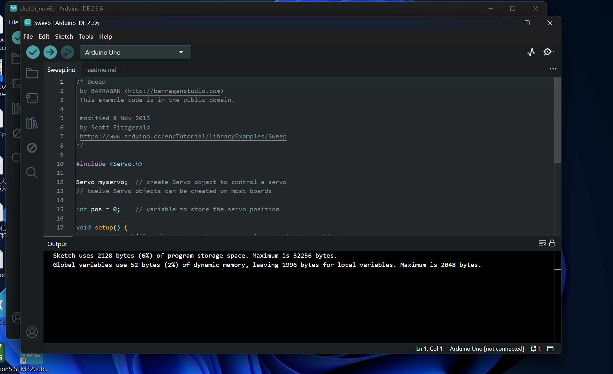
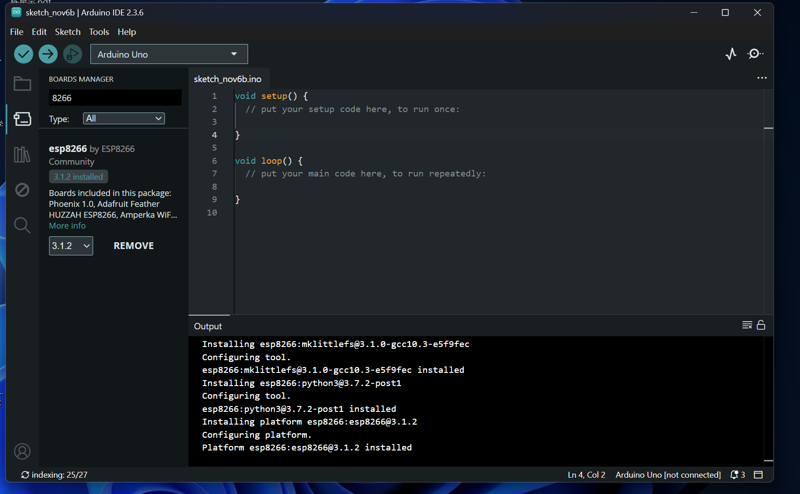
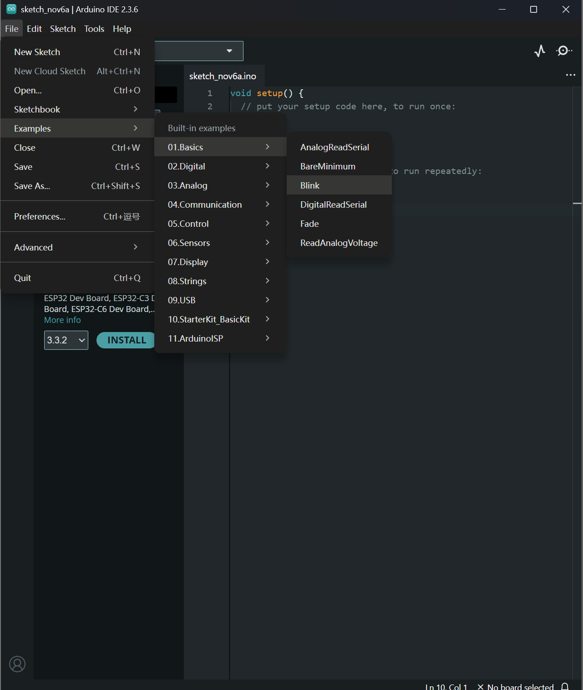
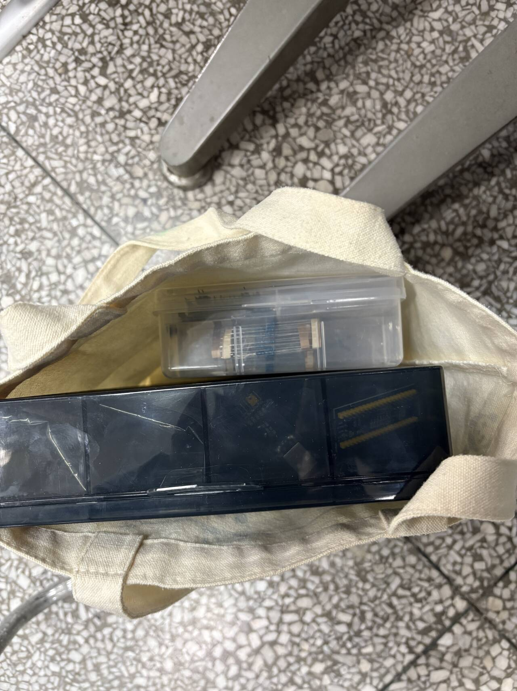
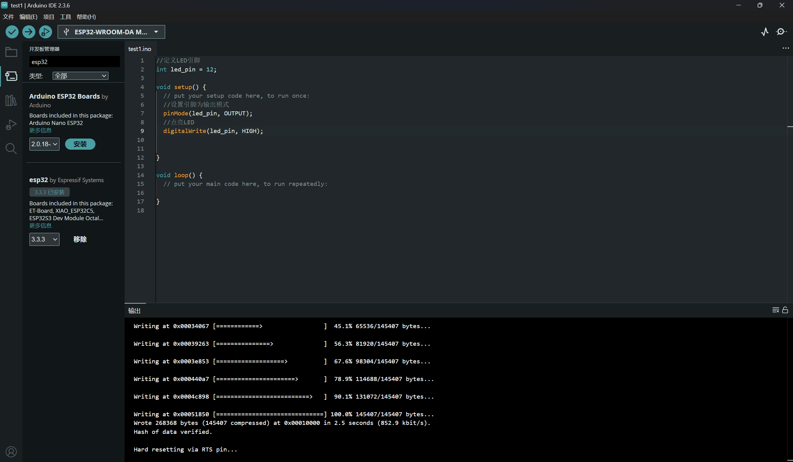
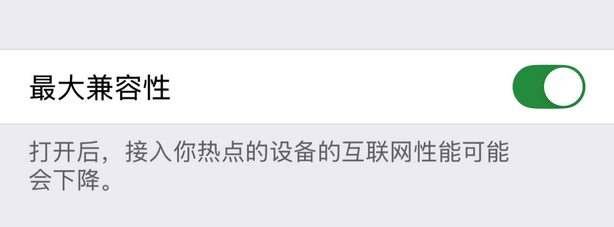
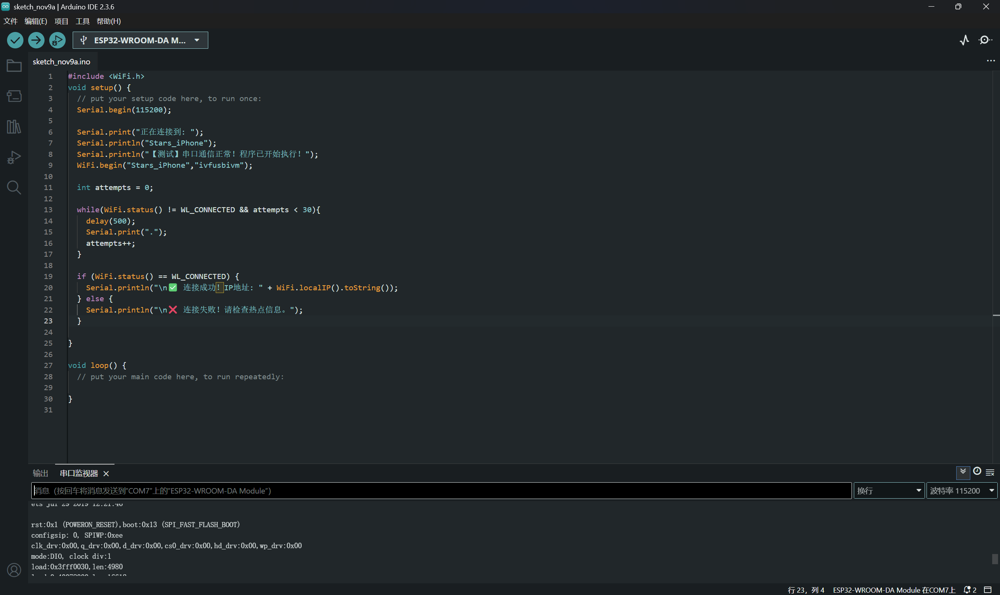
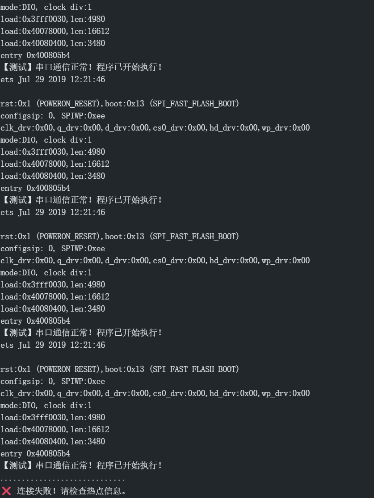
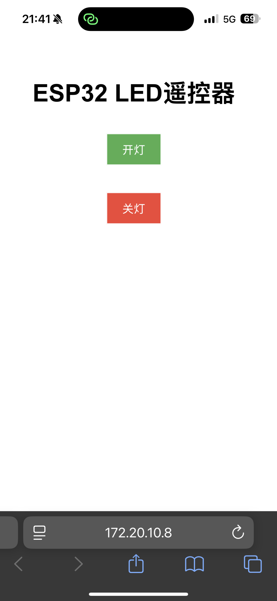

### 选择IoT？
&ensp;&ensp;&ensp;&ensp;首先这看似是一个迫不得已的选择，因为自己之前被其他工作室拒麻了:cry:,然后发现好像还有嵌入式工作室还在招新，并且还可以做一轮的题目，于是感觉发现一线生机.
&ensp;&ensp;&ensp;&ensp;不过，选这个方向，还是离不开自己对动手操作的热爱，当时早自习宣讲时有个学姐拿了一个四轴飞行器，给我留下了深刻的印象。在经历了失败之后，我认为自己更适合做一些更具体的东西，而操控组装硬件刚好符合，于是就“入坑”了   :smile:

&ensp;&ensp;&ensp;&ensp;最后，我认为嵌入式学习也像这招新题一样，是一场融合了软硬件的马拉松，需要持续努力
### 采购硬件
&ensp;&ensp;&ensp;&ensp;我浏览了一下网上硬件的出售情况，发现大多数是几个元件一起卖，于是顺便也简单了解了一下各个元件的外形。
&ensp;&ensp;&ensp;&ensp;

### 一、基础准备

#### 1.“大脑”
第一步，安装Arduino IDE



感觉自从准备工作室招新，自己已经安装了许多软件，从一开始的懵懂，到现在已经渐渐炉火纯青了。(除了有时候无论用wifi、热点或者梯子都登不进去的情况:pray:)

网上买的硬件终于到了！拿到它的那一刻感觉很兴奋:smile:


###### 接下来就是安装电路了
##### 这里组装电路的时候遇见了一个问题：有时候电阻两端的细丝很难插入面包板，容易把细丝弄歪，后面我灵机一动，将电阻要插入的小孔先用杜邦线来插一遍，这样相当于使小孔"打开"，电阻细丝就容易插进去了


终于亮灯啦:smile:
<video controls src="1075cc7a57a800b1747c4f49002a0b71.mp4" title="Title"></video>
还有闪烁版

#### 2.网络连接
真是服了苹果了，问了AI才知道——“很遗憾，苹果iOS系统目前不允许用户手动指定个人热点的频段，它会自动选择。如果您的ESP32无法连接iPhone热点，频段不兼容的可能性很大。”


之前用的时候发现手机的这个选项有个buff，所以从来没有开过，然后每次连接热点的时候都要关闭再打开才能连上，但是没有细致地去分析原因，现在知道原来有一个2.4GHz和5GHz频段的问题——Arduino更兼容2.4GHz的频段，而苹果默认的是5GHz频段




经过多次尝试，终于连上了！！！


### 二、“遥控器”

#### 1.网页服务器
这里直接选用了第一次点灯时的电路，不过灯换成了红色，因为这个task终于要完成了，鼓励一下自己！
```C
//先导入库函数
#include <WiFi.h>       // 实现网络连接
#include <WebServer.h>  // 提供Web服务器功能

// 我的手机热点信息(网络配置)
const char* ssid = "xxx";
const char* password = "xxx";

//控制外接在GPIO5上的LED
#define LED_PIN 5

// 使用http协议，所以直接在它的默认端口80上创建一个Web服务器对象
WebServer server(80);
/*为什么是http协议而不是https？
1.在ESP32上实现https需要更多复杂的配置步骤
2.https的加密解密运算会消耗更多的：处理能力、内存空间和存储空间（用于存放SSL/TLS证书）
3.作为点灯这样一个基础的实验，不需要过多的安全保障，热点密码足矣
*/


void setup() { // 启动Web服务器
  Serial.begin(115200); 
  /*Serial是ESP32与电脑串口通信的功能对象，这里启用串口通信。
  115200这个波特率稳定性高，许多开发板和固件也将它作为默认的串口监控波特率。
  当波特率太低时：数据传输会变得很慢；太高时：虽然速度更快，但对硬件和线材的要求更高。在复杂的电磁环境下，过高的波特率更容易受到干扰，导致数据错误，稳定性反而下降。*/

  pinMode(LED_PIN, OUTPUT);// 初始化硬件LED
  digitalWrite(LED_PIN, LOW); // 初始化时确保LED熄灭

  // 连接Wi-Fi
  WiFi.begin(ssid, password);
  Serial.print("正在连接WiFi"); //这里通过串口监视器上逐渐出现的小点来看wifi的连接情况
  while (WiFi.status() != WL_CONNECTED) { //WL_CONNECTED常量名源于WiFi.h库函数，直接用
    delay(1000);
    Serial.print(".");
  }
  Serial.println("WiFi连接成功!");

  // 设置服务器路由（将URL路径绑定到处理函数）
  server.on("/", handleRoot);   // 当访问根目录时
  server.on("/on", handleOn);   // 当访问 “/on” 时
  server.on("/off", handleOff); // 当访问 “/off” 时
  server.onNotFound(handleNotFound); // 当访问不存在的路径时

  // 启动服务器
  server.begin();
  Serial.println("Web服务器已启动!");
}

void loop() {
  server.handleClient(); // 持续持续检查并处理来自本人的http请求
}
```

>在完成代码编译、运行和wifi连接的时候，手机浏览器上输入http://[IP]即可进入网页


#### 2.“言出法随” 

```C
//控制外接在GPIO5上的LED
#define LED_PIN 5

// 处理根路径“/”的函数
void handleRoot() {
  // 构建一个简单的HTML网页，包含两个按钮
  String html = "<!DOCTYPE html> <html> <head> <meta charset='UTF-8'> 
<title>ESP32遥控器</title> <style>body{font-family:Arial; text-align:center; 
margin-top:50px;} button{padding:10px 20px; font-size:16px; margin:10px;}</
style> </head> <body>";
  html += "<h1>ESP32 LED遥控器</h1>";
  html += "<p><a href='/on'><button style='background-color: #4CAF50; color: 
white;'>开灯</button></a></p>";
  html += "<p><a href='/off'><button style='background-color: #f44336; color: 
white;'>关灯</button></a></p>";
  html += "</body> </html>";
  server.send(200, "text/html", html);
}

// 处理“/on”路径的函数
void handleOn() {
  digitalWrite(LED_PIN, HIGH); // 点亮LED
  Serial.println("收到开灯指令");
  // 返回一个提示信息，明确告知操作已成功执行，并2s后自动跳转回首页(提升了交互体验)
  server.send(200, "text/html", "<html><head><meta http-equiv='refresh' 
content='2;url=/'></head><body><p>LED已打开,2秒后返回...</p></body></html>");
}

// 处理“/off”路径的函数
void handleOff() {
  digitalWrite(LED_PIN, LOW); // 熄灭LED
  Serial.println("收到关灯指令");
  //同上
  server.send(200, "text/html", "<html><head><meta http-equiv='refresh' 
content='2;url=/'></head><body><p>LED已关闭,2秒后返回...</p></body></html>");
}

// 处理未找到的路径（返回404错误）
void handleNotFound() {
  server.send(404, "text/plain", "404: Not found");
}

void setup() { // 启动Web服务器
  Serial.begin(115200);
  pinMode(LED_PIN, OUTPUT);
  digitalWrite(LED_PIN, LOW); // 初始化时确保LED熄灭

  // 连接Wi-Fi
  WiFi.begin(ssid, password);
  Serial.print("正在连接WiFi");
  while (WiFi.status() != WL_CONNECTED) {
    delay(1000);
    Serial.print(".");
  }
  Serial.println("");
  Serial.println("WiFi连接成功!");

  // 设置服务器路由（将URL路径绑定到处理函数）
  server.on("/", handleRoot);   // 当访问根目录时
  server.on("/on", handleOn);   // 当访问 “/on” 时
  server.on("/off", handleOff); // 当访问 “/off” 时
  server.onNotFound(handleNotFound); // 当访问不存在的路径时

  // 启动服务器
  server.begin();
  Serial.println("Web服务器已启动!");
  Serial.println("请用浏览器访问以上IP地址");
}
```
这里代码中关于两个按钮的设计涉及一点前端的知识，在网上查了查

>手机网页图片：

看到这个结果，真的是非常的amazing啊，这下就要成为更加名副其实的点灯大师了
##### 上图的按钮相当于图形化编程，点击按钮就相当于进入了控制LED开或关的网页，同时执行相应的代码
##### 操作完成后，我突然遇见了一个尴尬的问题，就是我用手机操作，但没有可以另外录像的设备(人在图书馆)，于是又用电脑做了一遍<video controls src="102b54195dc960b90c3e16bd980052a0.mp4" title="Title"></video>

### 附加题
###### 我认为如果想实现异地控制点灯，可以将ESP32开发板与云端服务器相连，这样异地朋友可以通过访问云端服务器中的对应网页来实现(感觉类似于玩第五人格的时候，我邀请同伴一起组队，同伴可以与我布置的场景物品互动:smile:)